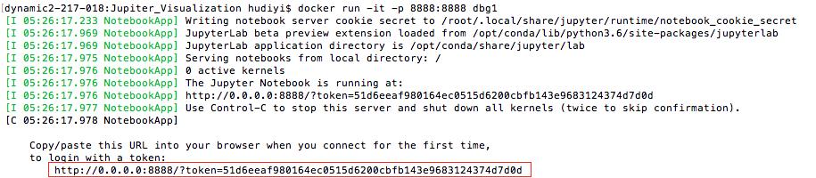

# Jupiter Visualization

Visualization tool for [Jupiter](https://github.com/ANRGUSC/Jupiter). This tool generates an interactive plot to show the scheduling result of WAVE and the dispatcher mapping of CIRCE.

## Directory Structure

```
.
├── README.md                   # this file
├── Dockerfile                  # file to generate the Docker image
├── visualizer.ipynb            # Jupyter notebook to generate the interactive plot
├── input_files                 # directory containing the files needed by this visualizer (output by Jupiter)
│   ├── DAG.txt                 # DAG representing the task graph
│   ├── circe_output.txt        # output file by CIRCE log
│   └── wave_output.txt         # output file by WAVE log
└── screenshots                 # screenshots for example run
```


## Usage

To visualize your own application. Replace the `DAG.txt`, `circe_output.txt` and `wave_output.txt` in `input_files` by the actual system log. Make sure the format of your logs are in line with the example files in `input_files`.

This visualizer is Dockerized. To run the application, you need to have [Docker](https://www.docker.com/get-docker) installed.

To generate the Docker image, run:

```
$ cd <path-to-this-repo>
$ docker build -t <name-of-the-image> .
```
To run the image and interact with the jupyter notebook, run:

```
docker run -it -p 8888:8888 <name-of-the-image>
```

You will see the output of the last command as below:



Copy the above URL in your browser. You will see a running Jupyter notebook session. Open the `visualizer.ipynb` notebook. Run all the cells. You will see the output of the visualizer in cell [4], as below:


Note that the time for generating the plot may be more than 10 minutes.
